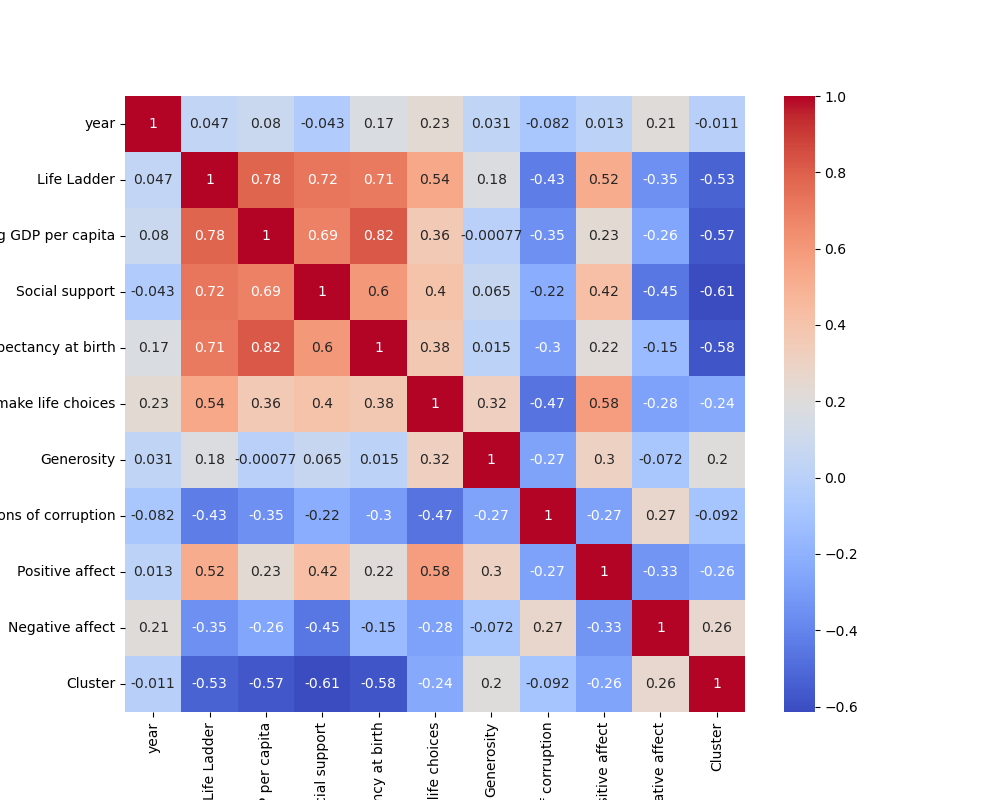
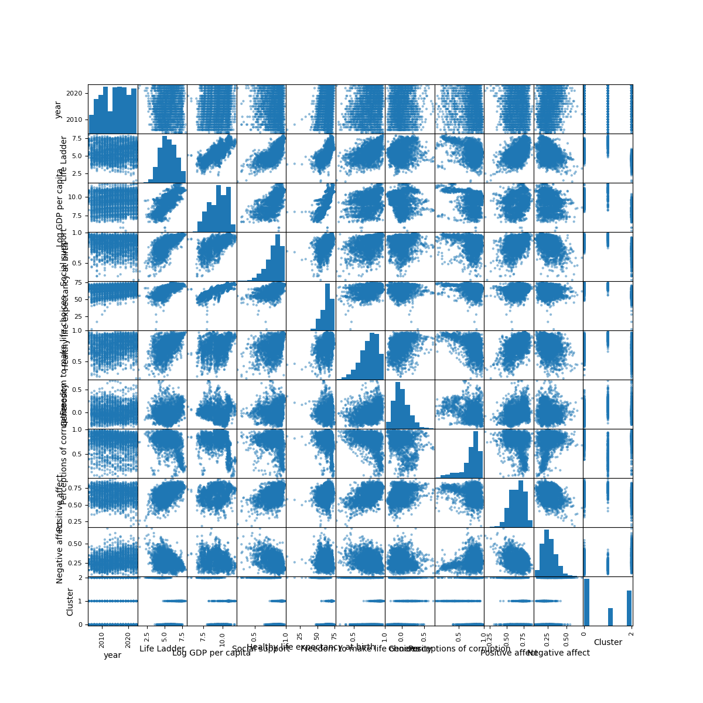
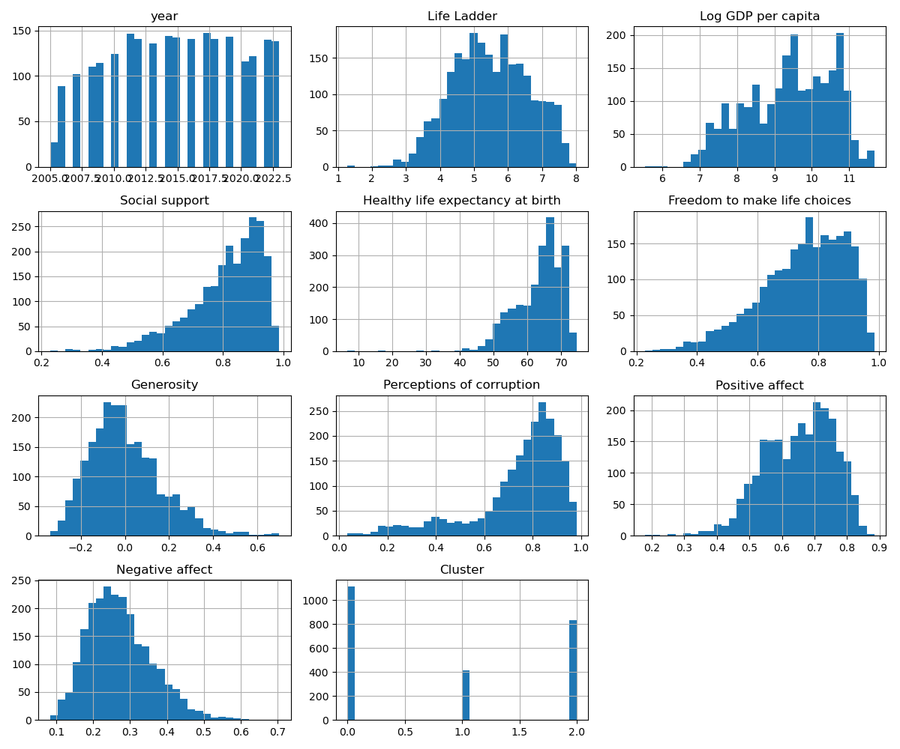
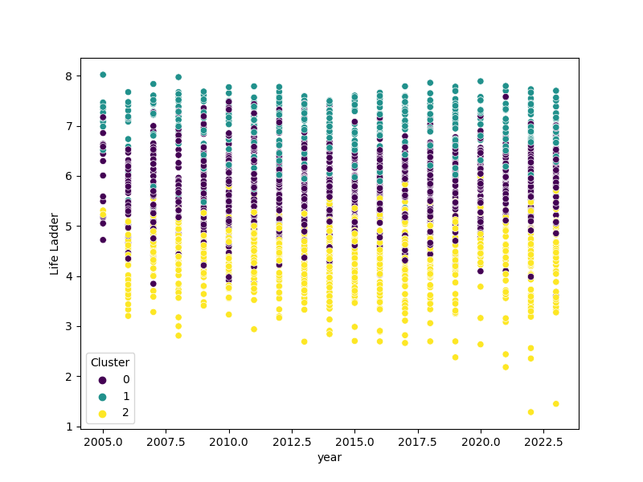

# Automated Analysis Report

## The Story Behind the Data

We started with an unfamiliar dataset, unsure of its structure or content. Our goal was to uncover its hidden narratives through systematic analysis and compelling visualizations. Here's what we discovered:

### The Dataset at a Glance

The dataset consists of 2363 rows and 11 columns. Below are the details of the columns:

- **Country name** (object)
- **year** (int64)
- **Life Ladder** (float64)
- **Log GDP per capita** (float64)
- **Social support** (float64)
- **Healthy life expectancy at birth** (float64)
- **Freedom to make life choices** (float64)
- **Generosity** (float64)
- **Perceptions of corruption** (float64)
- **Positive affect** (float64)
- **Negative affect** (float64)

We identified missing values in the following columns, indicating areas for potential data imputation:

- Country name: 0 missing values
- year: 0 missing values
- Life Ladder: 0 missing values
- Log GDP per capita: 28 missing values
- Social support: 13 missing values
- Healthy life expectancy at birth: 63 missing values
- Freedom to make life choices: 36 missing values
- Generosity: 81 missing values
- Perceptions of corruption: 125 missing values
- Positive affect: 24 missing values
- Negative affect: 16 missing values

### The Analysis Journey

We performed the following analyses to understand the dataset better:

- Calculated summary statistics to identify ranges, means, and variances.
- Detected outliers using Z-scores, revealing potential anomalies or extreme values.
- Conducted correlation analysis, highlighting relationships between numerical columns.
- Clustered data points into groups based on similarity, using K-means clustering.

### Insights Unveiled

Here are the significant insights we discovered:

- **Life Ladder** contains 2 potential outliers, suggesting anomalies worth investigating.
- **Log GDP per capita** contains 3 potential outliers, suggesting anomalies worth investigating.
- **Social support** contains 23 potential outliers, suggesting anomalies worth investigating.
- **Healthy life expectancy at birth** contains 14 potential outliers, suggesting anomalies worth investigating.
- **Freedom to make life choices** contains 10 potential outliers, suggesting anomalies worth investigating.
- **Generosity** contains 21 potential outliers, suggesting anomalies worth investigating.
- **Perceptions of corruption** contains 34 potential outliers, suggesting anomalies worth investigating.
- **Positive affect** contains 10 potential outliers, suggesting anomalies worth investigating.
- **Negative affect** contains 18 potential outliers, suggesting anomalies worth investigating.

From the correlation heatmap, we observed several strong and weak relationships between numerical columns, offering clues about dependencies in the dataset.
The clustering analysis revealed distinct groupings, providing a deeper understanding of inherent data patterns.

### Implications of the Findings

The findings from the analysis suggest actionable steps:
- Address missing data in key columns to improve dataset completeness.
- Investigate detected outliers to identify errors or opportunities.
- Leverage identified correlations for predictive modeling or optimization.
- Use clustering insights for targeted marketing, segmentation, or resource allocation.

## Visualizations

The following visualizations support our analysis:

