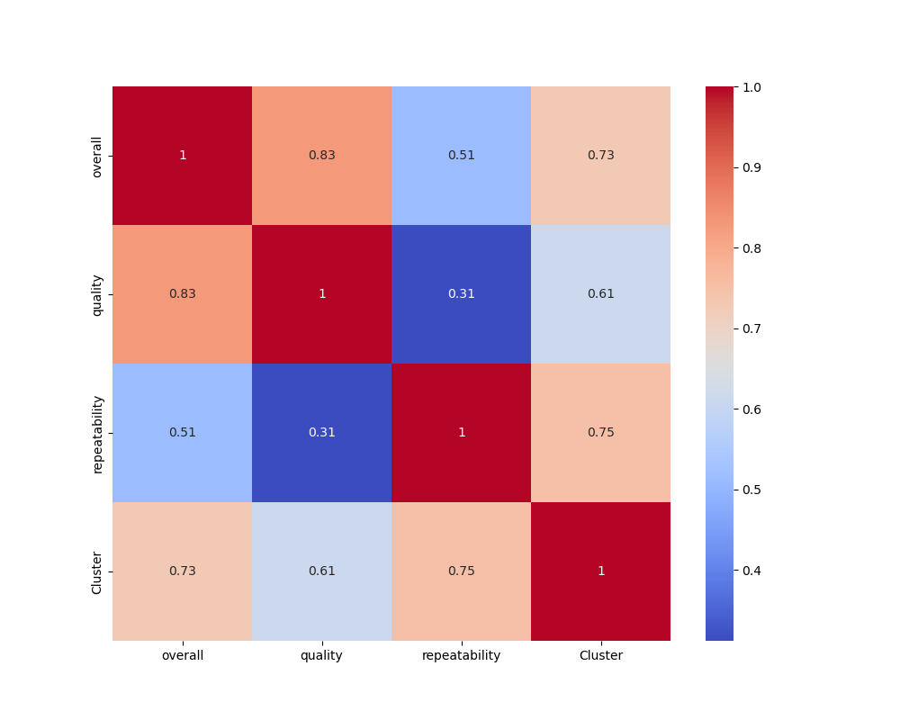
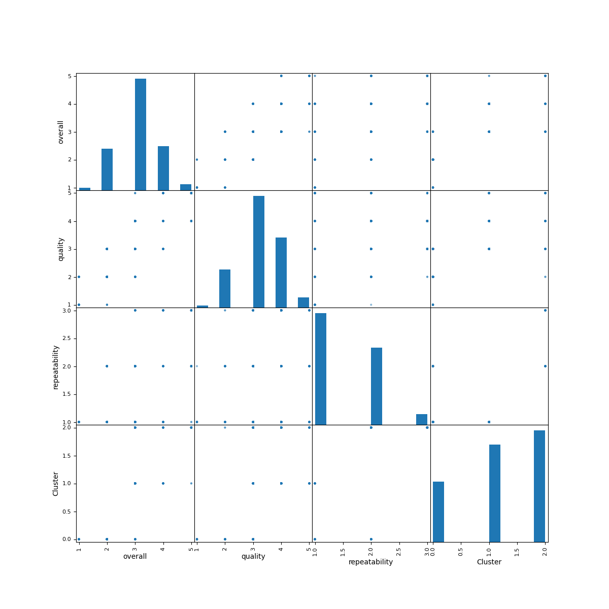
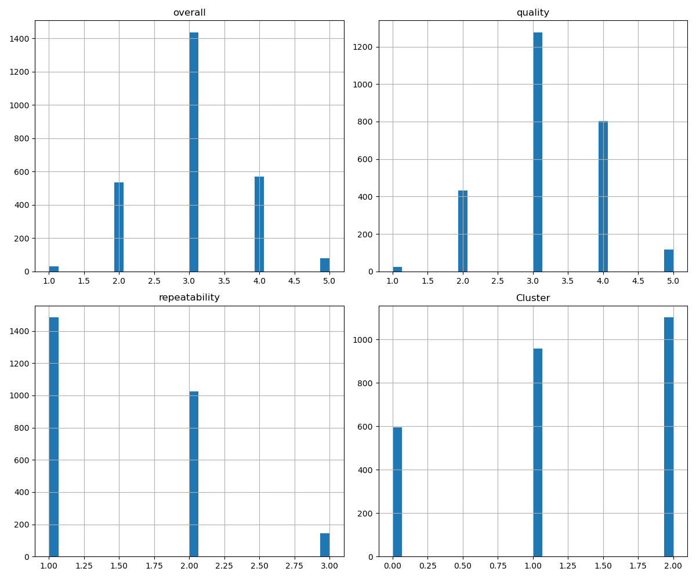
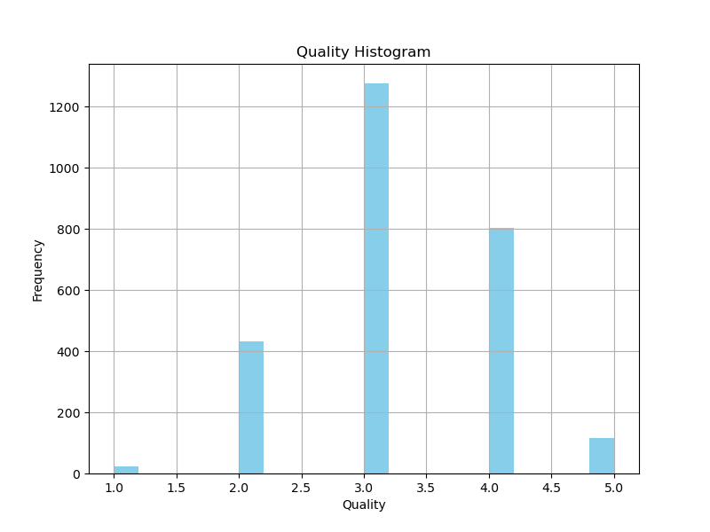
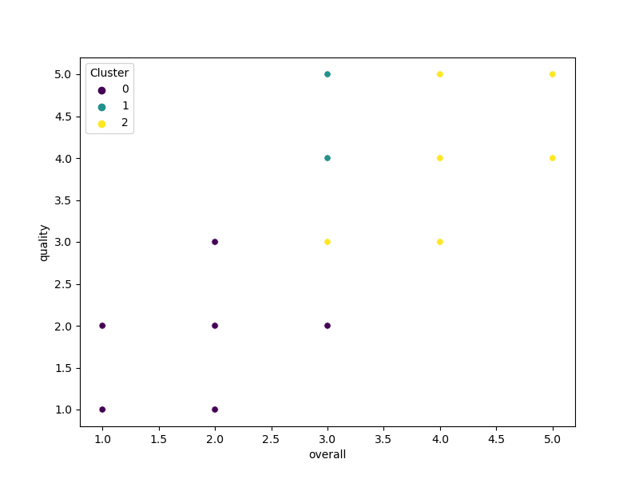

# Automated Analysis Report

## The Story Behind the Data

We started with an unfamiliar dataset, unsure of its structure or content. Our goal was to uncover its hidden narratives through systematic analysis and compelling visualizations. Here's what we discovered:

### The Dataset at a Glance

The dataset consists of 2652 rows and 8 columns. Below are the details of the columns:

- **date** (object)
- **language** (object)
- **type** (object)
- **title** (object)
- **by** (object)
- **overall** (int64)
- **quality** (int64)
- **repeatability** (int64)

We identified missing values in the following columns, indicating areas for potential data imputation:

- date: 99 missing values
- language: 0 missing values
- type: 0 missing values
- title: 0 missing values
- by: 262 missing values
- overall: 0 missing values
- quality: 0 missing values
- repeatability: 0 missing values

### The Analysis Journey

We performed the following analyses to understand the dataset better:

- Calculated summary statistics to identify ranges, means, and variances.
- Detected outliers using Z-scores, revealing potential anomalies or extreme values.
- Conducted correlation analysis, highlighting relationships between numerical columns.
- Clustered data points into groups based on similarity, using K-means clustering.

### Insights Unveiled

Here are the significant insights we discovered:

From the correlation heatmap, we observed several strong and weak relationships between numerical columns, offering clues about dependencies in the dataset.
The clustering analysis revealed distinct groupings, providing a deeper understanding of inherent data patterns.

### Implications of the Findings

The findings from the analysis suggest actionable steps:
- Address missing data in key columns to improve dataset completeness.
- Investigate detected outliers to identify errors or opportunities.
- Leverage identified correlations for predictive modeling or optimization.
- Use clustering insights for targeted marketing, segmentation, or resource allocation.

## Visualizations

The following visualizations support our analysis:

